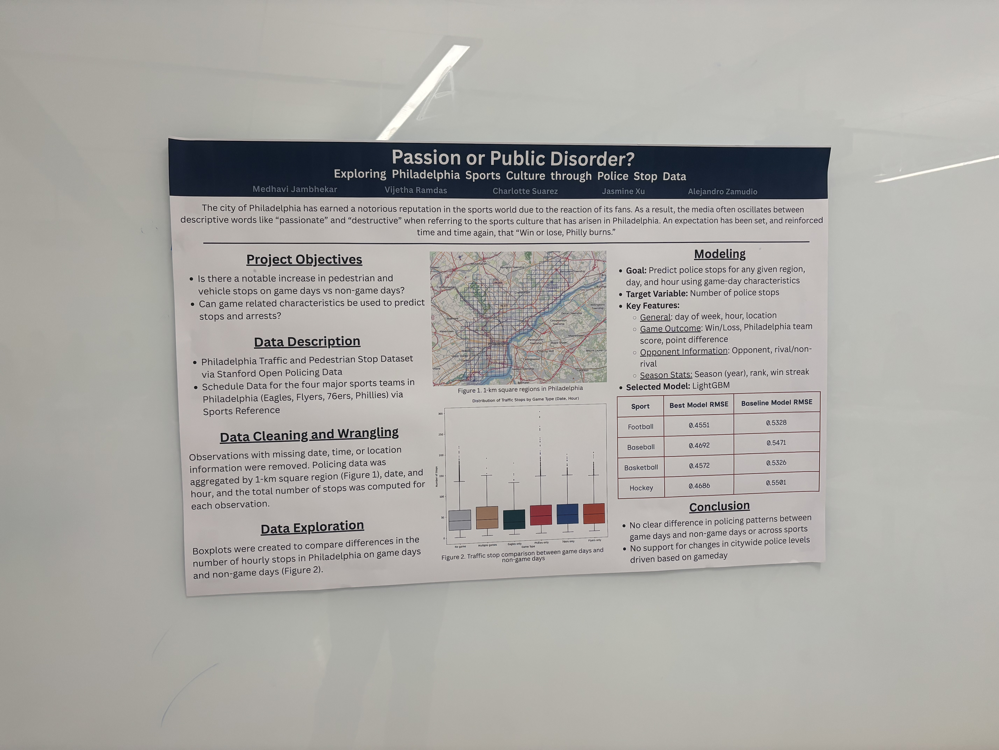

# **Passion or Public Disorder - Academic Project**
Analysis of Philadelphia Sports Culture through Police Traffic and Pedestrian Stop Data

**Course:** SDS 357 - Case Studies in Data Science

**Tools:** Python (Pandas, Scikit-lean, Matplotlib, XGboost), R (tidyverse)

**Semester:** Spring 2026

### **Description:** 
In this project, our group is interested in seeing if the stereotype of Philadelphia sports culture can be reflected in Police Stop Data from the city. In recent years, the city of Philadelphia has earned a notorious reputation in the sports world for the conduct of their fans. The media tends to juggle around words like "passionate" and "destructive" when referring to Philadelphia sports fans. A satirical expectation has been set that no matter if a team wins or loses, the city will see some sort of extreme reaction from the fans. Using Traffic and Pedestrian Stop data from the Stanford Open Policing Project, as well as sports schedule data from Sports Reference, our group was interested in investigating two things. First, how do traffic and pedestrian stop patterns differ between game days and non game days. Second, can in game characteristics like the score differential, opponent played or significance of the game be used to predict traffic stops or arrest rates. 

Throughout our project, we found and concluded that there was no clear difference in policing patters between game days and non game days. Furthermore, game related characteristics had little impact on whether stops increased or decreased. Our group determined that the public image given to sports culture in the city may be overexaggerated through extreme, but infrequent, events that occur.

### **Materials:** 
This page contains a Final Written Report for the project, along with an image of a poster presented at a session at the university. The report covers the entire process taken in our investigation such as data collection, data cleaning, analysis, modeling and generating conclusions. The report follows the stated instructions and requested format via the assignment rubric given for this specific project. The poster served as a in person opportunity to present our work to other students and members of the department. The poster briefly covers aspects of our analysis with most of the details being verbally elaborated on by members who were present at the session.

### **Assignment GitHub:** 
Per the instructions of the project, our group created and maintained a GitHub repository for the project. This repository contains coding scripts, analysis visualizations and other materials used in both the final report and presentations given to the class. You can view the repository using this link: https://github.com/utexas-SDS-357/sds357-project-sp26-i-love-philly

### **Project Acknowledgements:** 
This project was performed with 4 other group members as part of the course. This project is not a reflection of independent work, and was part of a collaborative effort by the group.

## **Poster:**

  

